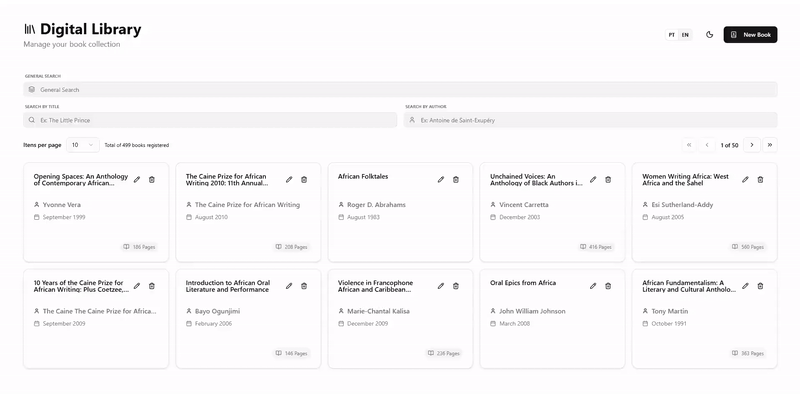

# Books Management System 📚

Sistema full-stack para gerenciamento de uma biblioteca digital. A solução integra um frontend em Next.js com um backend em Flask e banco de dados SQLite, operando em containers Docker.

## 🌐 Links do Projeto

O projeto está em deploy e pode ser acessado nos links abaixo:
- **Frontend**: [https://books-management-edugrutz.up.railway.app/](https://books-management-edugrutz.up.railway.app/)
- **API Backend**: [https://books-api-edugrutz.up.railway.app/](https://books-api-edugrutz.up.railway.app/)

---

## 🎥 Demonstração



---

## ✨ Funcionalidades Principais

### 🔍 Filtros e Busca Avançada
- **Busca Global**: Pesquisa por texto em títulos, autores e datas de publicação simultaneamente.
- **Filtros Específicos**: Busca dedicada por Título e Nome de Autor com suporte a correspondência parcial (LIKE).
- **Paginação Dinâmica**: Gerenciamento de grandes volumes de dados no servidor para otimização de performance.

### 📝 Operações de Gerenciamento (CRUD)
- **Cadastro**: Criação de novos registros com geração automática de slugs e IDs incrementais.
- **Edição**: Atualização completa de metadados dos livros (título, autor, bio, editora, data).
- **Exclusão**: Remoção definitiva de registros com confirmação de segurança (Alert Dialog).

### 🌍 UX e Internacionalização
- **Suporte Bilíngue**: Interface totalmente traduzida para Português (PT) e Inglês (EN).
- **Temas**: Suporte a modo escuro (Dark Mode) e claro (Light Mode) com persistência de preferência.
- **Feedback Visual**: Notificações em tempo real (Toasts) para sucesso ou erro em operações de escrita.

---

## 🛠️ Tecnologias Utilizadas

O projeto utiliza uma stack moderna e amplamente adotada pela comunidade:

### Frontend
- **Framework**: Next.js 16 (Canary) com App Router.
- **Biblioteca UI**: React 19.
- **Estilização**: Tailwind CSS 3.
- **Componentes**: shadcn/ui.
- **Gerenciamento de Formulários**: React Hook Form + Zod.
- **Internacionalização**: next-intl.
- **Testes**: Playwright.

### Backend
- **Framework**: Flask (Python).
- **Banco de Dados**: SQLite.
- **CORS**: Flask-CORS.
- **Integração de Dados**: sqlite3.

### Infraestrutura
- **Containerização**: Docker.
- **Orquestração**: Docker Compose.

---

## 🏗️ Estrutura do Projeto

```bash
.
├── _docker-compose           # Infraestrutura e orquestração
│   ├── docker-compose.yml    # Configuração de serviços
│   └── docker-up.bash        # Script de inicialização rápida
├── backend                   # API REST (Flask + SQLite)
│   ├── routes/               # Endpoints e controllers
│   ├── services.py           # Lógica de negócio e banco de dados
│   ├── build.bash            # Automação de build da imagem
│   └── db.sqlite             # Persistência de dados
└── frontend                  # Interface Web (Next.js)
    ├── build.bash            # Automação de build da imagem
    └── codes/                # Aplicação Next.js
        ├── src/
        │   ├── actions/      # Mutates via Server Actions
        │   ├── components/   # UI/UX (Shadcn + Tailwind)
        │   ├── services/     # Bridge de comunicação com API
        │   └── types/        # Modelagem TypeScript
        ├── messages/         # Dicionários i18n
        └── tests/            # Automação de testes E2E
```

---

## 🚀 Guia de Inicialização Completo

Siga os passos abaixo para clonar, construir e rodar o projeto localmente utilizando Docker.

### 1. Clonar o Repositório
Abra o terminal e execute o comando para clonar o projeto:
```bash
git clone git@github.com:edugrutz/books-management-docker-nextjs.git
cd books-management-docker-nextjs
```

### 2. Construir as Imagens Docker (Build)
O projeto utiliza imagens customizadas tanto para o frontend quanto para o backend. É necessário construí-las antes de subir os containers:

```bash
# Construir imagem do Backend
cd backend && bash build.bash && cd ..

# Construir imagem do Frontend
cd frontend && bash build.bash && cd ..
```

### 3. Subir os Serviços (Run)
Com as imagens construídas, utilize o Docker Compose para orquestrar os serviços:

```bash
cd _docker-compose
bash docker-up.bash
```

### 4. Acessar a Aplicação
Após a inicialização (que pode levar alguns segundos), acesse:
- **Interface Web (Frontend)**: [http://localhost:3000](http://localhost:3000)
- **API (Backend)**: [http://localhost:5000](http://localhost:5000)

---

## 🧠 Decisões Técnicas

Durante o desenvolvimento, algumas decisões de design foram tomadas para equilibrar simplicidade, prazos e a natureza do desafio:

1. **Tratamento de Dados Inconsistentes**: Foram identificados 2 registros com `ID null` no banco de dados original. Para manter a fidelidade aos dados fornecidos (evitando mutações diretas no banco em um desafio técnico), optei por filtrar esses registros via software utilizando a cláusula `WHERE id IS NOT NULL` em todas as consultas.
2. **Geração de Slugs**: Atualmente, o slug dos autores é gerado no frontend por simplicidade. Isso permite URLs amigáveis e filtragem rápida sem complexidade adicional na lógica de persistência do backend.
3. **Mecanismo de Busca**: O uso de filtros `WHERE` e `LIKE` no SQLite foi escolhido por ser uma solução simples e direta para o escopo do desafio. Em um projeto de larga escala e com maior volume de dados, o ideal seria implementar um motor de busca dedicado, como **ElasticSearch**, para garantir performance e recursos avançados de busca textual (fuzzy search, sinônimos, etc).

---

## 🔮 Futuras Melhorias e Prioridades

As melhorias abaixo foram mapeadas para elevar a maturidade técnica do projeto:

| Prioridade | Categoria | Descrição |
| :--- | :--- | :--- |
| **Alta** | Arquitetura | Migração do SQLite para PostgreSQL para suporte a concorrência e integridade referencial. |
| **Alta** | Dados | Normalização da tabela de autores, separando a biografia do autor da tabela de livros para evitar redundâncias. |
| **Média** | Segurança | Implementação de JWT (JSON Web Tokens) para proteção dos endpoints de mutação (POST, PUT, DELETE). |
| **Média** | Backend | Migração da lógica de geração de slugs para o backend utilizando bibliotecas padrão. |
| **Baixa** | Frontend | Implementação de cache avançado (SWR ou React Query) para otimização de requisições. |
| **Baixa** | DevObs | Implementação de documentação interativa via Swagger/OpenAPI. |

---

## 📄 Documentação Detalhada

Links para especificações técnicas de cada módulo:
- [Documentação do Backend](backend/README.md)
- [Documentação do Frontend](frontend/codes/README.md)